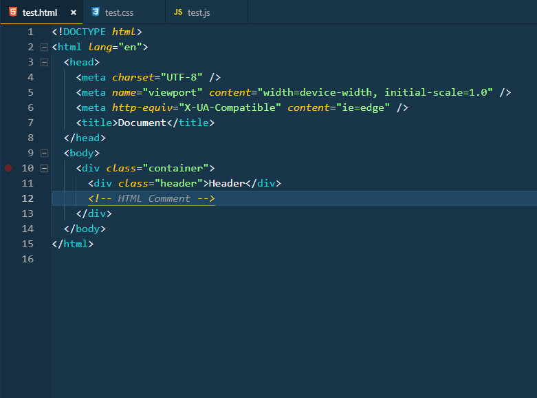
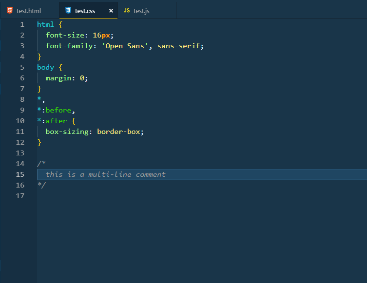
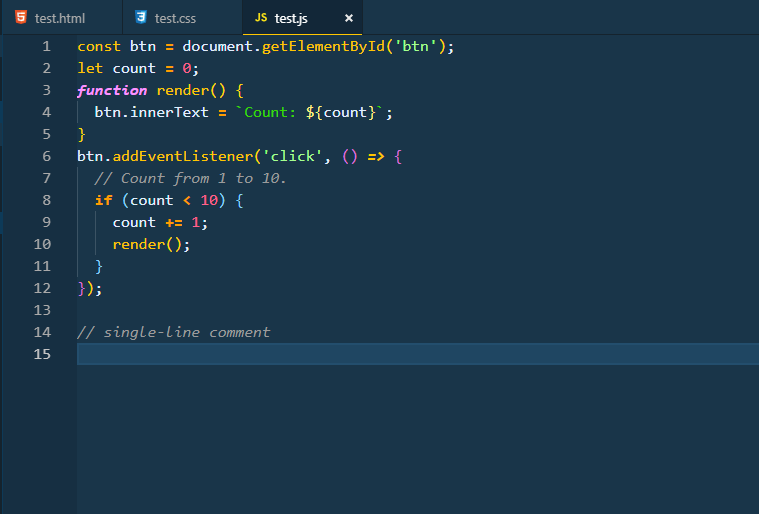

# Cold Night

VScode dark Theme For Developers Who Like To Code Late Into Cold Nights. and was Built for people with colorblindness and in low-light circumstances.

## Cold Night

### HTML

### CSS

### JAVASCRIPT

## Installing Theme

1.  Install [Visual Studio Code](https://code.visualstudio.com/)
2.  Launch Visual Studio Code
3.  Choose **Extensions** from menu
4.  Search for `cold-night`
5.  Click **Install** to install it
6.  From the menu bar click: Code > Preferences > Color Theme > **Cold Night**

## I Don't Like Something

if you see something amiss, please feel free to file an issue!

Any relevant changes for each version are documented in the changelog. Please update and check the changelog before filing any issues, as they may have already been taken care of.
